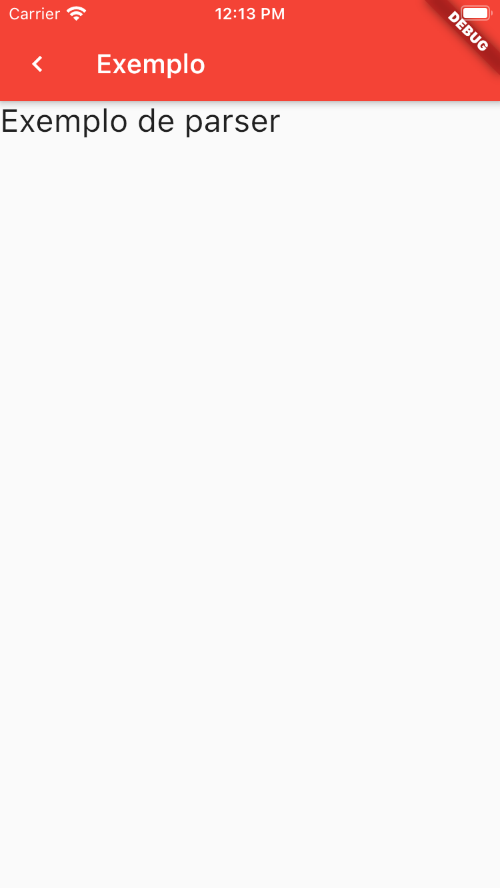

# screen_builder

A Flutter module to work with Server UI Backend driven.

Briefly, Backend-Driven Development (or Backend-Driven UI, or also Server-Driven UI) is the idea of developing front-end applications with screens and flows based on servers responses. This means screens and navigation have different behaviour depending on server’s responses.

# How to create a component/widget parser

1. Components parsers are created to interpret your backend json and transform to a specific widget.

```dart
import 'package:flutter/material.dart';
import 'package:screen_builder/screen_builder.dart';

class TextParser implements Parser<Text> {
  @override
  Text parseComponent(
      Component component, ClickListener listener, BuildContext context) {
    final data = component.data;
    final properties = component.properties;
    return Text(
      data['text'],
      style: TextStyle(
        fontSize: properties['font_size'],
      ),
    );
  }
}
```

# How to create a click/action parser

1. Click/Actions parsers are created to interpret your backend json and handle a user interaction.

```dart
import 'package:flutter/material.dart';
import 'package:screen_builder/screen_builder.dart';

class PrintClickListener implements ClickListener {
  @override
  void onClicked(UserAction action, BuildContext context) {
    print(action.type);
  }
}
```

# How to use

1. Add in the app/feature `pubspec.yaml` the dependency for the screen_builder service:

a. Can be with local path:
```dart
screen_builder:
    path: ../
```

b. Can be with pub.dev version:
```dart
screen_builder: ^1.0.0
```

c. With github location:
```dart
screen_builder: 
    url: https://github.com/youse-seguradora/mob-flutter-screen-builder.git
    ref: master
```

2. Get a Screen Builder instance:
```dart
final ScreenBuilder screenBuilder = ScreenBuilder.getInstance(
      parsers: { // Here can be any Parser implementation
        'app_bar': AppBarParser(),
        'button': ButtonParser(),
        'text': TextParser(),
      },
      listeners: {
        'print': PrintClickListener(), // Here can be any Click Listener implementation
      },
    );
```

3. Request for your backend a json that represents a screen and use the screen builder instance to parse and display it:
```dart
FutureBuilder(
      future: // Here you must to connect with your backend and get your json screen,
      builder: (context, snapshot) {
        if (snapshot.hasError) {
          return Scaffold(
            appBar: AppBar(title: const Text("Screen Builder")),
            body: Center(child: Text(snapshot.error.toString())),
          );
        }

        if (snapshot.hasData) {
          return screenBuilder.build(screen: snapshot.data, context: context);
        }

        return Scaffold(
          appBar: AppBar(title: const Text("Screen Builder")),
          body: const Center(child: const CircularProgressIndicator()),
        );
      },
    );
```

# Example

<table>
<tr>
<th>Example Screen</th>
<th>Example Json</th>
</tr>
<tr>
<td>
<pre>

</pre>
</td>
<td>
<pre>
{
    "version": "1",
    "module": "Quotation",
    "theme": "default",
    "screen": {
        "name": "QuotationScreen",
        "app_bar": {
            "name": "app_bar",
            "properties": {
                "center_title": false
            },
            "data": {
                "title": "Exemplo"
            },
            "action": {
                "type": "print"
            }
        },
        "content": [
            {
                "name": "text",
                "properties": {
                    "font_size": 24.0
                },
                "data": {
                    "text": "Exemplo de parser"
                }
            }
        ]
    }
}
</pre>
</td>
</tr>
</table>

# Next Jobs - TODO

- Try to change `Parser.parse` from static to not static to be testable.
- Use template method on some similar parser to reuse code.
- Change the map of parsers so something better than to add each parser there.

